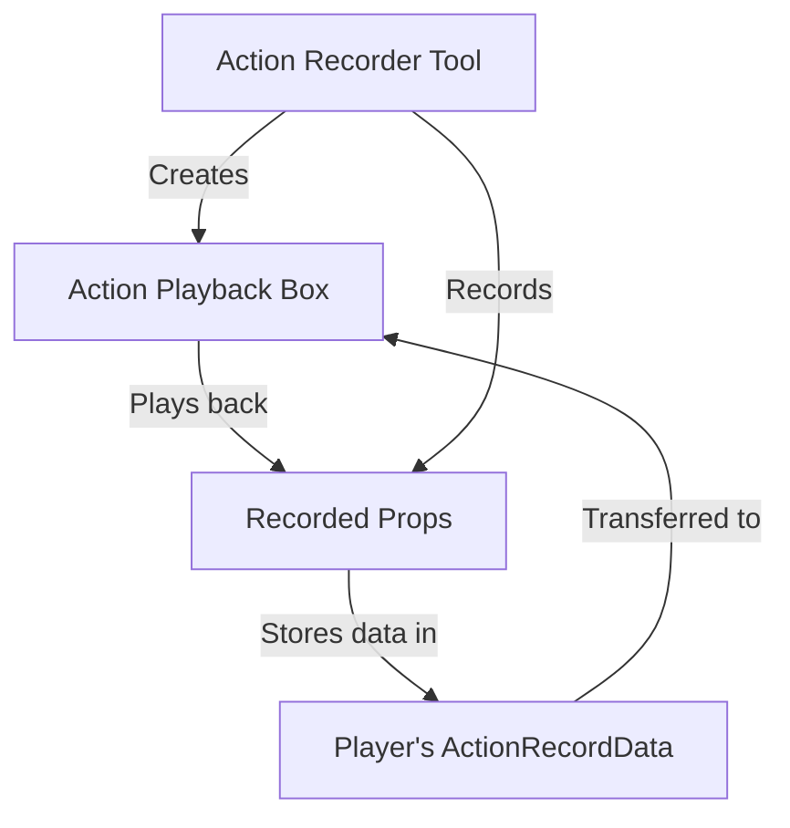
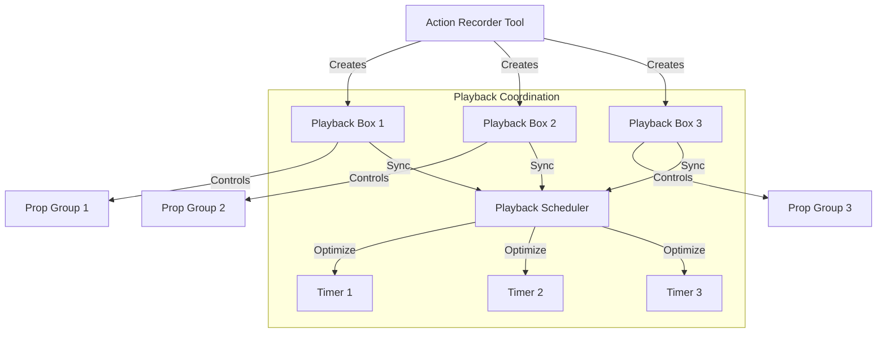
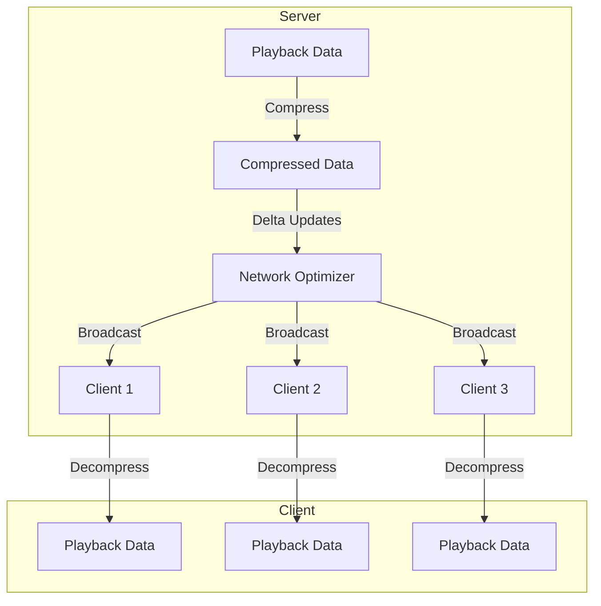
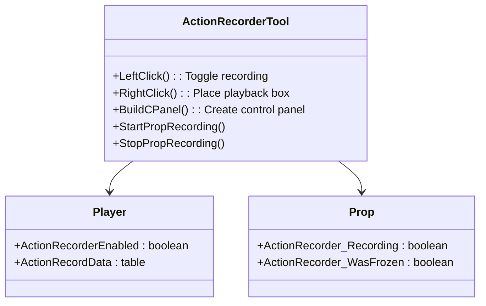
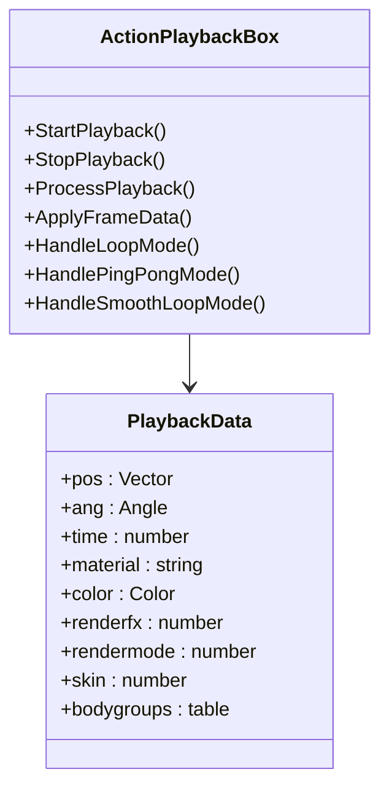

# Action Recorder Documentation

## Overview

The Action Recorder is a tool for Garry's Mod that allows players to record and playback movements of props. It consists of two main components:

1. **Action Recorder Tool** (`lua/weapons/gmod_tool/stools/actionrecorder.lua`) - The tool used to record actions
2. **Action Playback Box** (`lua/entities/action_playback_box.lua`) - The entity that plays back recorded actions

## System Architecture

## Current Limitations and Proposed Improvements

### Parallel Playback Limitations

1. **Single Global Timer**: All playback boxes share a single global timer, which can cause performance issues with many boxes
2. **Entity Control Conflicts**: Entities can only be controlled by one playback box at a time
3. **Limited Synchronization**: No proper synchronization between multiple playback boxes

### Proposed Architecture Improvements

#### Key Improvements:

1. **Decentralized Timers**: Each playback box gets its own optimized timer
2. **Playback Scheduler**: Coordinates multiple boxes to prevent conflicts
3. **Prop Grouping**: Props are divided into groups controlled by different boxes
4. **Priority System**: Allows some playbacks to take precedence over others

### Networking Limitations

1. **High Bandwidth Usage**: Sending full playback data to all clients
2. **Lack of State Synchronization**: Clients may see different playback states
3. **Inefficient Data Transfer**: Large recordings cause network congestion

### Proposed Networking Improvements

#### Key Improvements:

1. **Data Compression**: Reduce network traffic by compressing playback data
2. **Delta Updates**: Only send changes between frames instead of full data
3. **State Synchronization**: Ensure all clients see the same playback state
4. **Bandwidth Throttling**: Limit data transfer rate to prevent congestion

## Action Recorder Tool

### Key Features

- Record prop movements, rotations, and appearance changes
- Create playback boxes to replay recorded actions
- Configurable playback settings (speed, loop mode, easing, etc.)
- Client-side HUD and effects during recording

### Main Components

### Recording Process

1. Player activates the tool with left click
2. Tool starts recording data for all eligible props owned by the player
3. Data is stored in `Player.ActionRecordData` table
4. Recording can be stopped with another left click

### Playback Box Creation

1. Player right-clicks to place a playback box
2. Tool checks for existing boxes with same BoxID
3. Creates new `action_playback_box` entity
4. Transfers recorded data to the box
5. Configures box settings based on player preferences

## Action Playback Box

### Key Features

- Plays back recorded prop movements
- Supports different loop modes (no loop, loop, ping-pong, smooth return)
- Configurable playback speed and direction
- Easing functions for smooth transitions
- Wiremod integration for automation

### Main Components

### Playback Process

1. Box receives playback data from the tool
2. Player activates the box (via Use key or numpad)
3. Box starts processing playback frames
4. For each frame:
   - Calculate interpolation between current and target position/angle
   - Apply easing functions if configured
   - Update prop physics to match target position
   - Apply visual changes (material, color, etc.)

### Loop Modes

- **No Loop**: Plays once and stops
- **Loop**: Continuously repeats playback
- **Ping-Pong**: Plays forward then backward repeatedly
- **Smooth Return**: Plays forward then smoothly returns to start position

## Easing Functions

The system includes several easing functions for smooth transitions:

- Linear
- Sine
- Quadratic
- Cubic
- Quartic
- Quintic
- Exponential
- Circular
- Elastic
- Back
- Bounce
- Custom (editable via graph editor)

## Networking

The tool uses several network messages for client-server communication:

- `ActionRecorder_PlayStartSound`
- `ActionRecorder_PlayLoopSound`
- `ActionRecorder_PlayStopSound`
- `ActionRecorder_StopLoopSound`
- `ActionRecorderNotify`
- `ActionRecorder_FlashEffect`

## ConVars

The tool uses several console variables for configuration:

- `actionrecorder_playbackspeed`
- `actionrecorder_loop`
- `actionrecorder_freezeonend`
- `actionrecorder_playbacktype`
- `actionrecorder_model`
- `actionrecorder_boxid`
- `actionrecorder_globalmode`
- `actionrecorder_soundpath`
- `actionrecorder_easing`
- `actionrecorder_easing_amplitude`
- `actionrecorder_easing_frequency`
- `actionrecorder_easing_invert`
- `actionrecorder_easing_offset`

## Client-Side Effects

During recording, the client displays:

- Film grain effect (optional)
- Recording HUD element
- Flash effect when starting/stopping recording
- Custom sounds for recording start/stop

## Wiremod Integration

The playback box supports Wiremod inputs and outputs:

Inputs:
- Play
- Stop
- PlaybackSpeed
- LoopMode

Outputs:
- IsPlaying
- PlaybackSpeed
- Frame