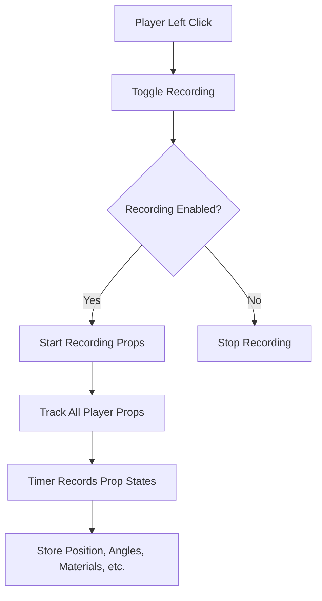
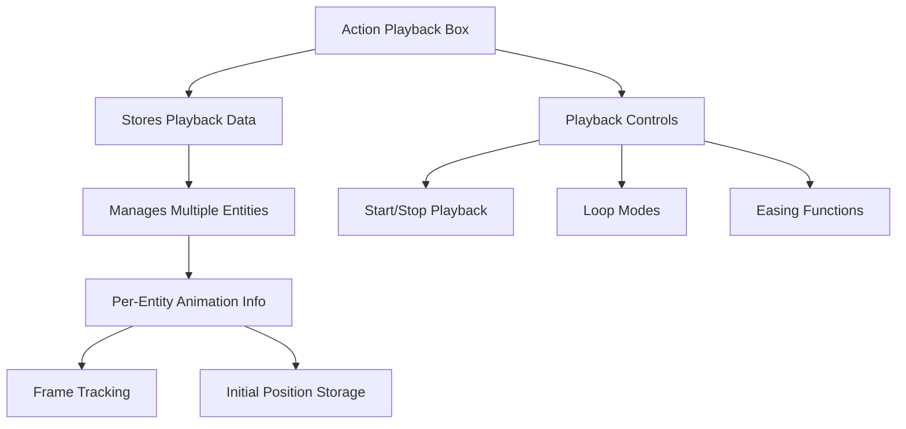
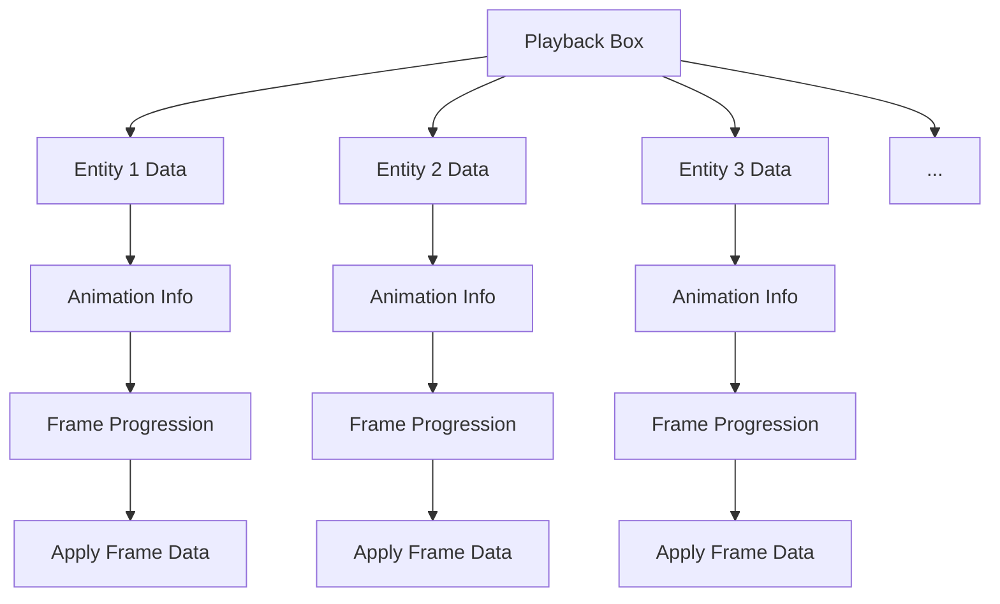
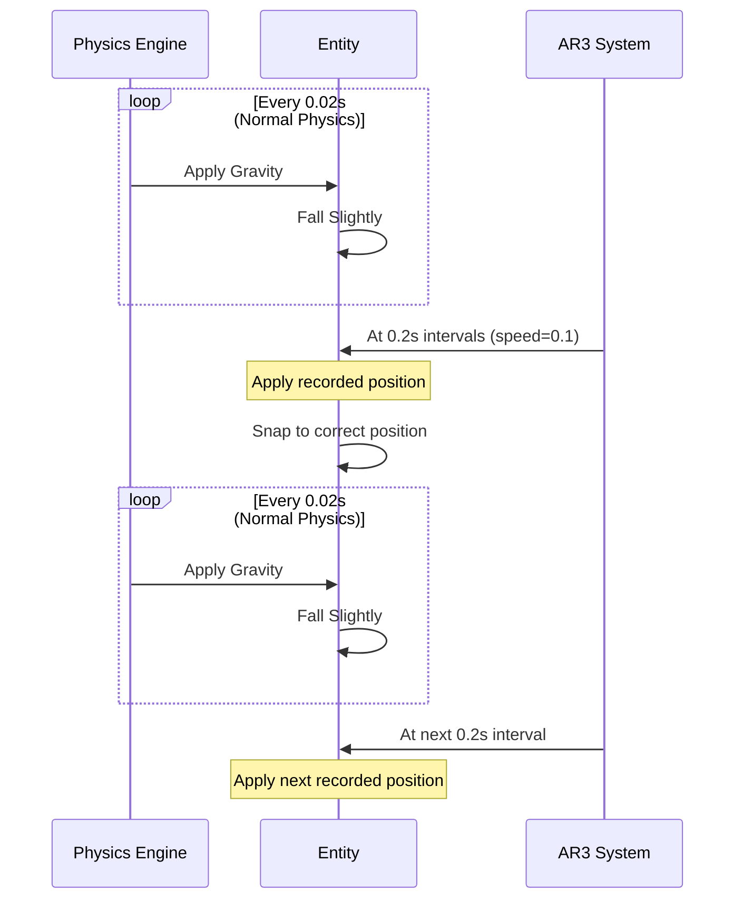
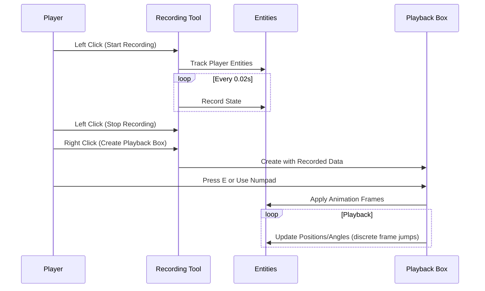

# Action Recorder 3 (AR3) - Code Documentation

This documentation provides a detailed explanation of how the Action Recorder 3 (AR3) mod works in Garry's Mod. AR3 is a powerful tool that allows players to record and playback the movements and properties of entities in the game.

## Overview

The Action Recorder mod works by recording the state of props (position, angles, materials, colors, etc.) at regular intervals and then playing back those recorded states to create animations. The mod features:

- Recording of multiple entities simultaneously
- Playback using specialized "Action Playback Boxes"
- Multiple playback modes (loop, ping-pong, etc.)
- Easing functions for smooth animations
- Wiremod integration for advanced control

## Architecture

The mod is structured around several key components:

### 1. Recording System
The recording system is implemented in `actionrecorder.lua` and works by tracking entities created by the player and periodically capturing their state.



### 2. Playback System
The playback system is implemented in `action_playback_box.lua` and handles the animation of recorded entities.



## Core Components

### Action Playback Box Entity

The `action_playback_box.lua` file defines the main entity that handles playback of recorded animations. This is the core of the mod's functionality.

Key features:
- Stores playback data for multiple entities
- Manages playback settings (speed, loop mode, etc.)
- Controls animation timing and frame progression
- Applies recorded states to entities during playback

### Recording Tool

The `actionrecorder.lua` file implements the tool that players use to record animations:

- Left click to start/stop recording
- Right click to create/update playback boxes
- Configurable settings for playback behavior

### Constants

The `ar_constants.lua` file defines shared constants used throughout the mod:

- Loop modes (NO_LOOP, LOOP, PING_PONG, NO_LOOP_SMOOTH)
- Playback directions (FORWARD, REVERSE)
- Playback types (ABSOLUTE, RELATIVE)
- Animation status states (NOT_STARTED, PLAYING, FINISHED, SMOOTH_RETURN)
- Frame interval (0.02 seconds)

### Easing Functions

The `action_recorder_easing.lua` file provides various easing functions for smooth animations:

- Linear
- EaseInOutSine
- EaseInOutQuad
- EaseInOutCubic
- EaseInOutExpo
- EaseOutBounce
- SawWave, TriangleWave, SquareWave
- Custom (user-defined)

## Multi-Entity Playback

One of the key features of AR3 is its ability to record and playback multiple entities simultaneously using a single playback box:



Each entity has its own animation information stored in the `AnimationInfo` table:
- `frameCount`: Total number of frames for this entity
- `direction`: Playback direction (forward or reverse)
- `status`: Current animation status
- `currentFrameIndex`: Current frame being played
- `initialPos`: Initial position when playback started
- `initialAng`: Initial angles when playback started

### How Multiple Entities Are Handled

1. **Data Storage**: When a playback box is created, it receives a table of playback data where each key is an entity index and each value is an array of frame data for that entity.

2. **Initialization**: When playback starts, the box captures the initial position and angles of each entity to be animated.

3. **Frame Synchronization**: Although each entity has its own frame count, they are synchronized during playback. The box maintains a global frame index that represents the minimum frame across all entities.

4. **Independent Progression**: Each entity can progress through its frames independently based on easing functions and playback speed.

5. **Completion Handling**: When an entity finishes its animation (based on loop mode), it's marked as finished. The playback box stops when all entities are finished.

## Playback Process

The playback process involves several steps:

1. **Start Playback**: 
   - Capture initial positions/angles of all entities
   - Initialize animation info for each entity
   - Set up global timer for frame updates

2. **Frame Processing**:
   - Calculate next frame for each entity
   - Apply frame data to entities (position, angles, materials, etc.)
   - Handle loop modes (ping-pong, looping, etc.)

3. **Frame Data Application**:
   - Position and angle updates using physics shadow control
   - Visual property updates (materials, colors, etc.)
   - Physics handling (motion enabling, collision groups)

4. **Completion**:
   - Handle different loop modes
   - Smooth return to initial positions (if configured)
   - Cleanup and resource management

## Wiremod Integration

The mod includes Wiremod integration for advanced control:

- Inputs: Play, Stop, PlaybackSpeed, LoopMode, Reset, SetFrame
- Outputs: IsPlaying, PlaybackSpeed, Frame, MaxFrames, LoopMode, Status

This allows for complex automation and control of playback boxes using Wiremod components.

## Configuration Options

The mod provides extensive configuration options:

### General Settings
- Playback Speed: Controls animation speed
- Loop Mode: Determines how animations repeat
- Playback Type: Absolute (exact positions) or Relative (offset from initial position)
- Model: Model used for the playback box
- Box ID: Identifier for the playback box
- Activation Sound: Sound played when starting playback

### Easing Settings
- Easing Type: Various mathematical functions for smooth animations
- Easing Amplitude, Frequency, Invert, Offset: Parameters for fine-tuning easing

### Client Settings
- HUD display
- Custom sounds
- Film grain effect

## Technical Details

### Frame Interval
The mod uses a fixed frame interval of 0.02 seconds (50 FPS) for recording and playback. This provides smooth animations while maintaining reasonable performance.

### Physics Handling
During playback, entities have their physics temporarily enabled and controlled through shadow physics. This allows precise positioning while maintaining realistic physics interactions.

### Memory Management
Playback data is stored efficiently in tables, and timers are properly cleaned up when playback stops or entities are removed.

## Understanding the Gravity Issue at Low Speeds

When using very low playback speeds (e.g., 0.1), you may notice that entities experience a slight downward movement between frames, as if gravity is briefly applied. This behavior is caused by how the frame advancement system works in AR3.

### Root Cause Analysis

Contrary to what might be expected, AR3 does NOT use interpolation between recorded frames. Instead, it uses a frame-skipping approach:

1. **Frame Advancement Logic**:
   In the `calculateNextFrame` function, the system calculates how many frames to advance based on the elapsed time and playback speed:
   ```lua
   local moveTimeInterval = GLOBAL_TIMER_INTERVAL / math.abs(speed)
   local framesToMove = math.floor(timeSinceLastMove / moveTimeInterval)
   ```

2. **Discrete Frame Jumps**:
   At normal speeds, entities move to the next frame every 0.02 seconds. At speed 0.1:
   - `moveTimeInterval` = 0.02 / 0.1 = 0.2 seconds
   - Entities jump 1 frame every 0.2 seconds (10x longer than normal)

3. **No Interpolation**:
   The system does NOT interpolate between frames. It jumps directly from one recorded frame to another, with no intermediate positions calculated.

4. **Physics Simulation Gap**:
   During the 0.2 seconds between frame updates at low speeds, entities are still subject to normal physics simulation, including gravity. This means the entity falls slightly due to gravity before the next position correction is applied.

5. **Shadow Physics Control**:
   The mod uses `phys:ComputeShadowControl(params)` to move entities, which works by:
   - Temporarily disabling normal physics
   - Moving the entity to the target position
   - Re-enabling physics
   - The entity then continues to be affected by physics (including gravity) until the next update

### Visual Representation



### Why This Is More Noticeable at Low Speeds

At normal playback speeds (e.g., 1.0):
- Entities move every 0.02 seconds
- Gravity has minimal time to affect entities between updates

At low playback speeds (e.g., 0.1):
- Entities move every 0.2 seconds
- Gravity has 10x more time to pull entities down before the next correction

### Lack of Interpolation

The AR3 system does NOT perform interpolation between recorded frames. Looking at the code, there are no interpolation functions (like `LerpVector` or similar) being used in the main playback loop. The system simply jumps from one recorded frame to another.

This is evident in the `ProcessPlayback` function where it directly accesses `frames[frameIndex]` without calculating any intermediate positions:
```lua
local frame = frames[frameIndex]
self:ApplyFrameData(ent, frame, basePos, false)
```

### Why Interpolation Is Missing

Based on the playback.txt file, it appears that the system was modified from an earlier version that may have used Think hooks. The current implementation uses a global timer system that advances frames discretely rather than continuously interpolating.

### Potential Solutions

1. **Implement True Interpolation**:
   Modify the system to calculate intermediate positions between recorded frames using linear interpolation (Lerp) or more sophisticated methods.

2. **Increase Physics Update Rate**:
   Modify the system to update entity positions more frequently at low speeds, though this would impact performance.

3. **Physicsless Teleport Option**:
   The mod already has a "Physicsless Teleport" option that sets `teleportdistance = 0.1`. This could be enhanced to completely disable physics between updates.

4. **Continuous Physics Adjustment**:
   Instead of discrete position setting, continuously apply forces to guide the entity along the recorded path.

Currently, the mod uses shadow physics control via `ComputeShadowControl`, which is the standard approach for moving physics objects in Garry's Mod. The lack of interpolation between frames is the core issue that causes the gravity effect at low speeds.

## Usage Flow



This documentation provides a comprehensive overview of how the Action Recorder 3 mod works, with particular attention to its multi-entity playback capabilities and the physics behavior at low playback speeds due to the lack of interpolation between frames.